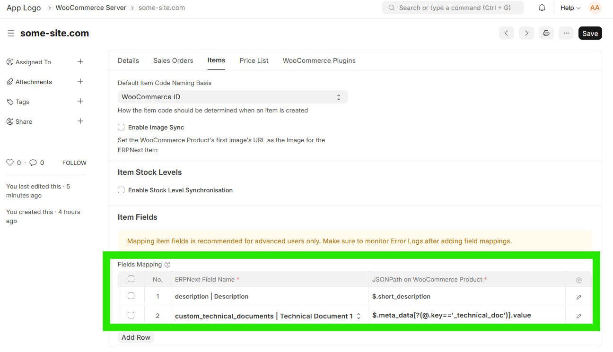

# Items Sync

## Setup

To link your ERPNext Item to a WooCommerce Product:
- If the WooCommerce Product already exists, specify the WooCommerce ID and WooCommerce Server
- If you want the item to be created in WooCommerce, specify only the WooCommerce Server

## Hooks

- Every time an Item is updated or created, a synchronisation will take place for the item if:
  -  A row exists in the **Item's** *WooCommerce Servers* child table with a blank/empty *WooCommerce ID* and *Enable Sync* is ticked: A linked WooCommerce Product will be created, **OR**
  -  A row exists in the **Item's** *WooCommerce Servers* child table with a value set in *WooCommerce ID* and *Enable Sync* is ticked: The existing WooCommerce Product will be updated

## Manual Trigger
- Item Synchronisation can also be triggered from an **Item**, by clicking on *Actions* > *Sync this Item with WooCommerce*
- Item Synchronisation can also be triggered from a **WooCommerce Item**, by clicking on *Actions* > *Sync this Product with ERPNext*

## Background Job

Every hour, a background task runs that performs the following steps:
1. Retrieve a list of **WooCommerce Products** that have been modified since the *Last Syncronisation Date* (on **WooCommerce Integration Settings**) 
2. Compare each **WooCommerce Product** with its ERPNext **Item** counterpart, creating an **Item** if it doesn't exist or updating the relevant **Item**

## Synchronisation Logic
When comparing a **WooCommerce Item** with it's counterpart ERPNext **Item**, the `date_modified` field on **WooCommerce Item** is compared with the `modified` field of ERPNext **Item**. The last modified document will be used as master when syncronising

## Fields Mapping

| WooCommerce  | ERPNext      | Note                                                                                                                       |
| ------------ | ------------ | -------------------------------------------------------------------------------------------------------------------------- |
| `id`         | *Item Code*  | Only if *Default Item Code Naming Basis* is set to *WooCommerce ID* on **WooCommerce Server**                              |
| `sku`        | *Item Code*  | Only if *Default Item Code Naming Basis* is set to *Product SKU* on **WooCommerce Server**                                 |
| `name`       | *Item Name*  |                                                                                                                            |
| `type`       |              | `simple` ≡ Normal **Item**                                                                                                 |
|              |              | `variable` ≡ Template **Item** (*Has Variants* is checked).                                                                |
|              |              | `variant` ≡ **Item** Variant (*Variant Of* is set)                                                                         |
| `attributes` | *Attributes* | Missing **Item Attributes* will automatically be created in both systems                                                   |
| `images[0]`  | *Image*      | One way sync - the URL of the first image on WooCommerce will be saved in the Image field. Setting  needs to be turned on. |

## Custom Fields Mapping

You can use [JSONPath](https://pypi.org/project/jsonpath-ng/) to map **Item** fields to specific **WooCommerce Product** fields.

Here are a few examples:
- `$.short_description` retrieves the content of the 'Short Description' WooCommerce Product field.
- `$.meta_data[0].id` retrieves the content of the first item's `id` field in the WooCommerce Product Metadata.
- `$.meta_data[?(@.key=='main_product_max_quantity_to_all')].value` retrieves the value of a Metadata entry with a `key` of `main_product_max_quantity_to_all`

where `$` refers to the **WooCommerce Product** object

To figure out the correct JSONPath expression, you can:
1. Go to any **WooCommerce Request Log** and filter for the `products` endpoints
2. Open [JSONPath Online Validator](https://jsonpath.com/) and copy the relevant object from the **WooCommerce Request Log** *Response* field to the *Document* text box.
3. Play around to get the JSONPath Query to return what you need. LLM's can be a big help here.

**Note that this is recommended for advanced users only. This is a very basic functionality - there are no field type conversions possible as of yet.

## Troubleshooting
- You can look at the list of **WooCommerce Products** from within ERPNext by opening the **WooCommerce Product** doctype. This is a [Virtual DocType](https://frappeframework.com/docs/v15/user/en/basics/doctypes/virtual-doctype) that interacts directly with your WooCommerce site's API interface
- Any errors during this process can be found under **Error Log**.
- You can also check the **Scheduled Job Log** for the `sync_items.run_items_sync` Scheduled Job.
- A history of all API calls made to your Wordpress Site can be found under **WooCommerce Request Log**

