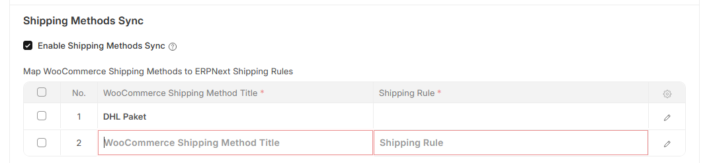
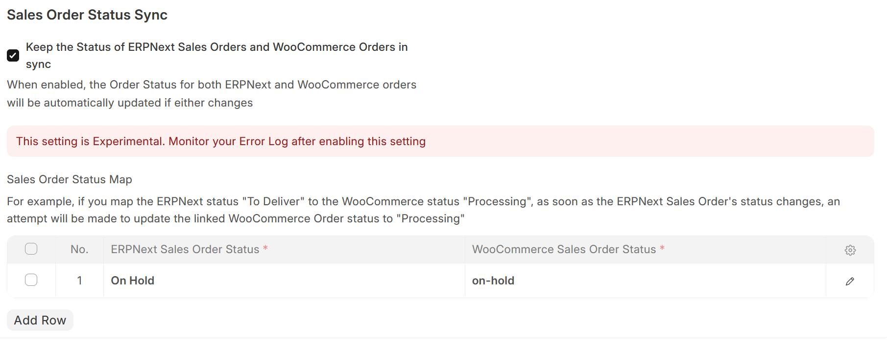

# Sales Order Sync

## Background Job

Every hour, a background task runs that performs the following steps:
1. Retrieve a list of **WooCommerce Orders** that have been modified since the *Last Syncronisation Date* (on **WooCommerce Integration Settings**) 
2. Retrieve a list of ERPNext **Sales Orders** that are already linked to the **WooCommerce Orders** from Step 1
3. Retrieve a list of ERPNext **Sales Orders** that have been modified since the *Last Syncronisation Date* (on **WooCommerce Integration Settings**)
4. If necessary, retrieve a list of **WooCommerce Orders** that are already linked to the ERPNext **Sales Orders** from Step 3
5. Compare each **WooCommerce Order** with its ERPNext **Sales Orders** counterpart, creating an order if it doesn't exist

## Hooks

- Every time a Sales Order is submitted, a synchronisation will take place for the Sales Order if:
  -  A valid *WooCommerce Server* and *WooCommerce ID* is specified on **Sales Order**

In order to make this work you need to configure the webhook in both, ERPNext and WooCommerce:
1. From ERPNext you need to get the access keys from the Woocommerce server configuration, in the WooCommerce Webhook Settings.
2. Create the webhook inside WooCommerce using the "Order created" topic and the rest of the data obtained on step 1.

## Manual Trigger
- Sales Order Synchronisation can also be triggered from an **Sales Order**, by changing the field *WooCommerce Status*
- Sales Order Synchronisation can also be triggered from an **Sales Order**, by clicking on *Actions* > *Sync this Item with WooCommerce*
- Sales Order Synchronisation can also be triggered from a **WooCommerce Order**, by clicking on *Actions* > *Sync this Order with ERPNext*

## Background Job

Every hour, a background task runs that performs the following steps:
1. Retrieve a list of **WooCommerce Orders** that have been modified since the *Last Syncronisation Date* (on **WooCommerce Integration Settings**) 
2. Compare each **WooCommerce Order** with its ERPNext **Sales Order** counterpart, creating a **Sales Order** if it doesn't exist or updating the relevant **Sales Order**

## Synchronisation Logic
When comparing a **WooCommerce Order** with it's counterpart ERPNext **Sales Order**, the `date_modified` field on **WooCommerce Order** is compared with the `modified` field of ERPNext **Sales Order**. The last modified document will be used as master when syncronising

Note that if sync for an **Item** is disabled (i.e. the "Enabled" checkbox on the Item's WooCommerce Server row is unchecked) and an **WooCommerce Order** is placed for this item, synchronisation will be re-enabled for this item.

## Fields Mapping

| WooCommerce   | ERPNext                                       | Note                                                                                                                                                                                  |
| ------------- | --------------------------------------------- | ------------------------------------------------------------------------------------------------------------------------------------------------------------------------------------- |
| billing       | **Address** with type *Billing*               | See **Customer Synchronisation** below. Checks if the `billing.email` field matches an existing **Customer's** `woocommerce_identifier` field. If not, a new **Customer** is created. |
|               | **Contact**                                   |                                                                                                                                                                                       |
| shipping      | **Adress** with type *Shipping*               | See **Address  Synchronsation** below                                                                                                                                                 |
| line_items    | **Item**                                      | Checks if a linked **Item** exists, else a new Item is created                                                                                                                        |
| id            | **Sales Order** > *Customer's Purchase Order* |                                                                                                                                                                                       |
|               | **Sales Order** > *Woocommerce ID*            |                                                                                                                                                                                       |
| currency      | **Sales Order** > *Currency*                  |                                                                                                                                                                                       |
| customer_note | **Sales Order** > *WooCommerce Customer Note* |                                                                                                                                                                                       |

## Customer Synchronisation

Each **Customer** record has a `woocommerce_identifier` custom field. This identifier is set depending on if the **WooCommerce Order** is from a guest or not:

| Case                                                                                                                                        | `woocommerce_identifier`    |
| ------------------------------------------------------------------------------------------------------------------------------------------- | --------------------------- |
| Guest (`customer_id` on **WooCommerce Order** is empty or 0)                                                                                | `Guest-{order_id}`          |
| Company (`billing.company` on **WooCommerce Order** is set), **Only if *Enable Dual Accounts for Same Email (Private/Company)* is checked** | `{billing.email}-{company}` |
| Individual (`billing.company` on **WooCommerce Order** is not set)                                                                          | `billing.email`             |

## Address Synchronisation
- If the billing and shipping address on the **WooCommerce Order** is the same, a single **Address** will be created with both the *Preferred Billing Address* and *Preferred Shipping Address* checkboxes ticked.
- If an address with *Preferred Billing Address*/*Preferred Shipping Address* ticked aleady exists, this address will be updated

## Shipping Rule Synchronisation
- You can enable the synchronisation of WooCommerce Shipping Methods to ERPNext Shipping Rules on Sales Orders
- For this to work, you have to map WooCommerce Shipping Methods to ERPNext Shipping Rules 
  - You can find the *WooCommerce Shipping Method Title* fields by looking at the `method_title` values in **WooCommerce Order** > *Shipping Lines*

## Automatic Order Status Synchronisation

⚠️ This setting is Experimental. Monitor your Error Log after enabling this setting
- You can enable the synchronisation of ERPNext Order Status to WooCommerce Order Status by checking the "Keep the Status of ERPNext Sales Orders and WooCommerce Orders in sync" checkbox
- For this to work, you have to map **ERPNext Sales Order Statuses** to **WooCommerce Sales Order Statuses**
- For example, if you map `On Hold` (ERPNext Sales Order Status) to `on-hold` (WooCommerce Sales Order Status), if you change a Sales Order's status to `On Hold`, it'll automatically attempt to set the WooCommerce Order's status to `On  Hold`

## Troubleshooting
- You can look at the list of **WooCommerce Orders** from within ERPNext by opening the **WooCommerce Order** doctype. This is a [Virtual DocType](https://frappeframework.com/docs/v15/user/en/basics/doctypes/virtual-doctype) that interacts directly with your WooCommerce site's API interface
- Any errors during this process can be found under **Error Log**.
- You can also check the **Scheduled Job Log** for the `sync_sales_orders.run_sales_orders_sync` Scheduled Job.
- A history of all API calls made to your Wordpress Site can be found under **WooCommerce Request Log**

